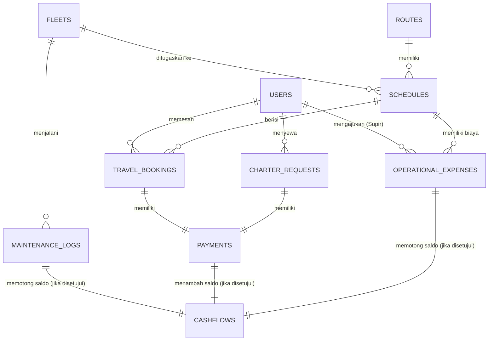

# PT. Rini Trans Putri - Backend API Service 🚀

[](https://nodejs.org/)
[](https://expressjs.com/)
[](https://www.postgresql.org/)
[](https://knexjs.org/)
[](http://localhost:5000/api-docs)

Sistem Backend berbasis RESTful API berkinerja tinggi untuk mengelola ekosistem layanan transportasi darat modern (Travel Regular, Penyewaan Pariwisata/Charter, dan Ekspedisi/Kurir). Aplikasi dirancang secara komprehensif mulai dari pemesanan tiket, *seat-locking* real-time, manajemen armada, hingga sistem pelaporan keuangan (*cashflow* & buku besar) otomatis berbasis pemicu (*trigger*).

---

## 📌 Daftar Isi
- [👥 Aktor & Hak Akses (User Roles & ACL)](#-aktor--hak-akses-user-roles--acl)
- [⚡ Perubahan Terbaru & Refactoring (Juni & Juli 2026)](#-perubahan-terbaru--refactoring-juni--juli-2026)
- [🛠️ Arsitektur & Struktur File](#️-arsitektur--struktur-file)
- [🗄️ Skema Database & Relasi](#️-skema-database--relasi)
- [💻 Tech Stack & Library](#-tech-stack--library)
- [🚀 Panduan Instalasi & Menjalankan Aplikasi](#-panduan-instalasi--menjalankan-aplikasi)

---

## 👥 Aktor & Hak Akses (User Roles & ACL)

Aplikasi ini mengadopsi kontrol akses berbasis peran (RBAC) yang ketat untuk mengamankan data dan membedakan alur kerja:

* **Customer**: Mendaftar dan login mandiri. Dapat mencari jadwal perjalanan aktif, memesan kursi travel (dengan sistem kunci kursi 10 menit), mengajukan sewa charter pariwisata, melakukan pengiriman paket, mengunggah bukti pembayaran, serta memantau riwayat transaksi personal.
* **Driver (Supir)**: Login menggunakan akun khusus yang didaftarkan oleh Super Admin. Driver berhak memantau tugas perjalanan yang diberikan, melihat manifest penumpang per keberangkatan, memperbarui status perjalanan secara real-time, mencatat log perawatan armada (servis rutin/masuk bengkel), dan mengajukan biaya operasional perjalanan (tol, bensin, parkir).
* **Super Admin**: Pengendali penuh sistem. Mengelola seluruh master data, memvalidasi dan memverifikasi bukti transaksi, memverifikasi log perawatan dan klaim biaya operasional driver, serta memantau dashboard analitik keuangan (*ledger cashflow*, *Gross*, dan *Net Profit*). *Catatan keamanan: Super Admin hanya dapat mengubah (update) dan menghapus (delete) akun dengan role Customer atau Driver. Akun sesama Super Admin tidak dapat diubah atau dihapus untuk menjaga integritas sistem.*

---

## ⚡ Perubahan Terbaru & Refactoring (Juni & Juli 2026)

Baru-baru ini telah dilakukan evaluasi, perbaikan bug alur bisnis, dan peningkatan kualitas kode (*refactoring*) di seluruh aplikasi untuk meningkatkan performa, skalabilitas, dan keandalan sistem:

### 📅 Juli 2026 (Penyelesaian Alur Perjalanan Paket Khusus & Keuangan Supir)
1. **Integrasi Rute Null untuk Pengiriman Paket Khusus**:
   * Mengubah relasi query di model `DriverModel.getAssignedSchedules` menggunakan `leftJoin` pada tabel `routes` agar perjalanan khusus pengiriman paket (berstatus `route_id = null`) dapat tampil dengan benar di layar tugas aktif supir.
   * Menarik informasi rute asal/tujuan dari paket itu sendiri dan mengisikannya secara dinamis ke objek jadwal jika rute bernilai kosong.
2. **Penyelesaian Masalah Timezone Offset**:
   * Menambahkan helper format tanggal berbasis lokal (`Asia/Jakarta`) di model supir dan controller penugasan untuk menyamakan perbandingan tanggal keberangkatan paket dengan jadwal perjalanan, menghindari bug pergeseran tanggal ke hari sebelumnya akibat standardisasi UTC.
3. **Penyajian Data Alamat yang Lebih Bersih**:
   * Membuat helper pemformatan alamat penerima paket dari objek JSON database menjadi string alamat yang bersih dan terstruktur untuk di-render di antarmuka riwayat tugas supir (dilengkapi tooltip hover).
4. **Penyelesaian Masalah Tab Selesai Penugasan Admin**:
   * Menyesuaikan endpoint `getAssignments` admin agar ketika fase tugas diset ke `'completed'`, backend tetap menghitung paket berstatus `'delivered'` atau `'selesai'` agar penugasan selesai tidak hilang secara gaib.
5. **Pagination Tab Selesai Admin**:
   * Mengimplementasikan sistem pagination berbasis Server-Side Rendering (SSR) dengan batas maksimal **8 item** per halaman pada daftar penugasan selesai di panel admin.
6. **Pembersihan Berkas Sampah (Root Folder Cleanup)**:
   * Menghapus 25 skrip diagnostik sementara di folder root untuk menjaga kebersihan repositori dan meminimalisir kekacauan berkas.
7. **Pembaruan Dokumentasi Swagger API**:
   * Melengkapi spesifikasi OpenAPI untuk endpoint `unassign` dan `archive` yang sebelumnya belum terdokumentasikan, serta memperbarui enum `assigned` pada parameter query `phase`.

### 📅 Juni 2026 (Optimasi & Refactoring Sistem)
1. **Optimasi Performa Dashboard Admin (Pencegahan N+1 Query)**:
   * Memindahkan logika kueri dashboard yang kompleks dari `dashboard.controller.js` ke model terdedikasi `src/models/dashboard.model.js`.
   * Menerapkan teknik **Batch-fetching** dengan peta pencarian (**Lookup Maps**) berkinerja $O(1)$ untuk menggantikan iterasi kueri satu per satu (N+1 query loop). Hal ini berhasil mereduksi beban database secara signifikan dan mempercepat response time pada endpoint `/api/admin/dashboard/active-duties` dan `/api/admin/dashboard/metrics`.
2. **Penyederhanaan Registrasi Rute CRUD (Shared Helper)**:
   * Memperkenalkan helper terpusat `crudRoute.js` di dalam folder `src/helpers/`.
   * Menghilangkan duplikasi kode registrasi rute CRUD master data pada `src/routes/masterData.routes.js` dan `src/routes/cms.routes.js` agar sejalan dengan prinsip *DRY (Don't Repeat Yourself)*.
3. **Pengujian Integrasi Otomatis (Automation Integration Tests)**:
   * Mengintegrasikan kerangka pengujian **Jest** dan **Supertest** untuk memastikan stabilitas dan keandalan API.
   * Menambahkan berkas pengujian komprehensif di `__tests__/api.test.js` yang memvalidasi 15 skenario pengujian utama (Auth input validation, Public endpoints, JWT Route Protection, & Zod schemas verification).
4. **Perbaikan Bug Manifest & Model Supir**:
   * Memperbaiki bug kritis di `src/models/driver.model.js` pada pencarian manifest penumpang supir yang sebelumnya mencocokkan status pembayaran `['paid', 'prepaid']` (yang mana tidak ada di DB), sekarang disesuaikan ke nilai status database yang valid yaitu `['selesai']`. Hal ini memperbaiki isu manifes penumpang yang selalu tampil kosong.
5. **Penyempurnaan Pesan Kesalahan User-Friendly & Konsistensi Bahasa**:
   * Mengubah istilah respon API dari "driver" menjadi "supir" di seluruh kontroler untuk menjaga konsistensi istilah.
   * Menangani kesalahan SQL Foreign Key constraint (integritas referensial database) pada `masterData.controller.js` dan mengubah pesan error bawaan Postgres yang rumit menjadi pesan Bahasa Indonesia yang ramah pengguna: *"Data tidak dapat dihapus karena sedang digunakan oleh data lain."*
6. **Perbaikan Skema Registrasi**:
   * Menambahkan pengembalian data nomor telepon (`phone_number`) dalam klausa `.returning()` pada model pengguna `src/models/user.model.js` saat registrasi berhasil dilakukan.

---

## 🛠️ Arsitektur & Struktur File

Backend ini mengimplementasikan arsitektur **Modular Component-based** untuk memisahkan tanggung jawab (Separation of Concerns):

```text
backend-kerjapraktik/
├── __tests__/          # Automated Integration Tests (Jest & Supertest)
│   └── api.test.js     # Berkas skenario uji endpoint API & skema validasi Zod
├── src/
│   ├── config/         # Konfigurasi database Knex, integrasi mailer, & setup Swagger JSDoc
│   ├── controllers/    # Handler HTTP request & response (Logika Kontroler)
│   ├── db/             # Skema migrasi tabel & data dummy (Knex Migrations & Seeds)
│   ├── helpers/        # Utilitas & helper pendukung aplikasi (e.g. crudRoute)
│   ├── jobs/           # Pekerjaan latar belakang (Cron Jobs: Auto-cancel Seat Lock)
│   ├── middlewares/    # Middleware autentikasi JWT, otorisasi role, validasi Zod, & pengunggahan file (Multer)
│   ├── models/         # Interaksi query database relasional menggunakan Knex Builder
│   ├── routes/         # Definisi router API Express
│   └── app.js          # Inisialisasi Express app & middleware global
├── public/
│   └── uploads/        # Penyimpanan lokal file statis yang diunggah (bukti transfer, kuitansi)
├── package.json        # Dependensi & script aplikasi
└── README.md
```

### 🏷️ Konvensi Penamaan File (Dot Case Notation)
Pemberian nama file pada seluruh modul menggunakan standar `nama-modul.tipe.js` (contoh: `auth.routes.js`, `travel.controller.js`, `driver.model.js`). Konvensi ini menjamin kelancaran *deployment* lintas sistem operasi (khususnya ke server Linux yang bersifat *case-sensitive*) serta memudahkan pencarian dan pemetaan file dalam editor.

---

## 🗄️ Skema Database & Relasi

Aplikasi menggunakan database **PostgreSQL** relasional dengan tabel-tabel utama sebagai berikut:



> [!NOTE]
> Sistem kas masuk (*income*) dan kas keluar (*expense*) dicatat secara otomatis ke dalam tabel `cashflows` melalui database trigger atau integrasi model ketika transaksi/biaya operasional disetujui oleh Super Admin.

---

## 💻 Tech Stack & Library

* **Web Server Framework**: Express.js (v5.x)
* **SQL Query Builder**: Knex.js (v3.x)
* **Database Engine**: PostgreSQL (v14+)
* **Engine Runtime**: Node.js (v18+)

### Dependensi Pendukung Utama:
* **Validation**: `zod` - Skema validasi request body yang kuat.
* **Security**: `bcryptjs` (Hashing sandi), `jsonwebtoken` (Otentikasi token JWT stateless), `helmet` (Header security), `cors` (Pembatasan origin aplikasi).
* **Media Handler**: `multer` - Manajemen pengunggahan file fisik (gambar kuitansi & bukti transfer).
* **Background Worker**: `node-cron` - Eksekusi tugas berkala (penghapusan otomatis kunci kursi travel).
* **Documentation**: `swagger-jsdoc` & `swagger-ui-express` - Dokumentasi API dinamis berbasis JSDoc.

### Dependensi Pengembangan & Pengujian (DevDependencies):
* **Testing Tool**: `jest` - Test runner untuk pengujian otomatis.
* **HTTP Assertion**: `supertest` - Library untuk melakukan simulasi request HTTP ke endpoint Express.
* **Process Manager**: `nodemon` - Hot-reloading server selama pengembangan.

---

## 🚀 Panduan Instalasi & Menjalankan Aplikasi

Ikuti petunjuk di bawah ini untuk menyiapkan backend di lingkungan lokal Anda:

### 1. Prasyarat Sistem
* **Node.js** (Versi LTS terbaru direkomendasikan)
* **PostgreSQL Database** lokal/cloud (Supabase / Neon DB / PostgreSQL Desktop)

### 2. Instalasi Dependensi
Kloning repositori dan pasang seluruh paket dependensi:
```bash
git clone https://github.com/RafaelPransa/backend-travel.git
cd backend-travel
npm install
```

### 3. Konfigurasi Variabel Lingkungan (`.env`)
Salin berkas template lingkungan yang disediakan:
```bash
cp .env.example .env
```
Sesuaikan konfigurasi kredensial PostgreSQL dan SMTP Mailer Anda di dalam berkas `.env` yang baru dibuat:
```env
PORT=5000
DB_CLIENT=pg
JWT_SECRET=rahasia_kunci_jwt_anda_disini
ALLOWED_ORIGINS=http://localhost:3000,http://localhost:5173

# === KONFIGURASI DATABASE ===
DB_HOST=127.0.0.1
DB_PORT=5432
DB_USER=postgres
DB_PASSWORD=password_postgres_anda
DB_NAME=rini_trans_db

# === KONFIGURASI SMTP EMAIL MAILER ===
SMTP_HOST=smtp.mailtrap.io
SMTP_PORT=2525
SMTP_USER=username_mailtrap_anda
SMTP_PASS=password_mailtrap_anda
SMTP_FROM="PT. Rini Trans Putri <noreply@rinitransputri.com>"
FRONTEND_URL=http://localhost:5173
```

### 4. Migrasi & Pengisian Data Awal (Seeds)
Buat kerangka tabel dan masukkan data dummy awal (seperti akun administrator default, armada awal, dan rute) menggunakan Knex CLI:
```bash
# Menjalankan migrasi database
npx knex migrate:latest

# Memasukkan data seeder awal
npx knex seed:run
```

### 5. Jalankan Aplikasi
Jalankan server Express menggunakan nodemon untuk mode pengembangan (*development*):
```bash
npm run dev
```
Server akan berjalan secara lokal di: `http://localhost:5000`

### 6. Menjalankan Uji Otomatis (Automation Testing)
Aplikasi ini dilengkapi dengan rangkaian unit & integration test untuk menjamin setiap endpoint berfungsi sebagaimana mestinya tanpa menimbulkan regresi kode (*regression break*).

Jalankan perintah berikut untuk mengeksekusi suite uji coba:
```bash
npm test
```

Uji otomatis ini menyimulasikan skenario berikut secara headless:
* Validasi input format email dan sandi minimal 6 karakter pada autentikasi.
* Verifikasi format respon data pada rute publik (`/`, schedules, banners, destinations, promotions).
* Proteksi otorisasi yang menolak panggilan API tanpa menyertakan JWT token pada endpoint krusial (bookings, history, dashboard, driver area).

### 7. Tes API secara Interaktif (Swagger UI)
Akses endpoint berikut pada browser Anda untuk menjelajahi dokumentasi API yang lengkap dan mengujinya secara langsung:
👉 **[http://localhost:5000/api-docs](http://localhost:5000/api-docs)**

> [!IMPORTANT]
> Untuk menguji rute yang terproteksi (Admin/Driver/Customer), gunakan endpoint `/api/auth/login` untuk mendapatkan JWT token. Klik tombol **Authorize** di pojok kanan atas Swagger UI, kemudian masukkan token dengan format: `Bearer <token_jwt_anda>`.
